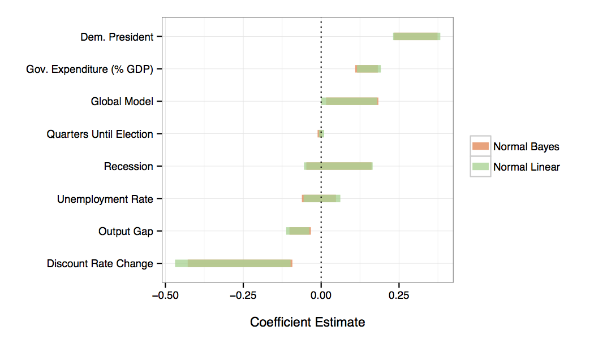
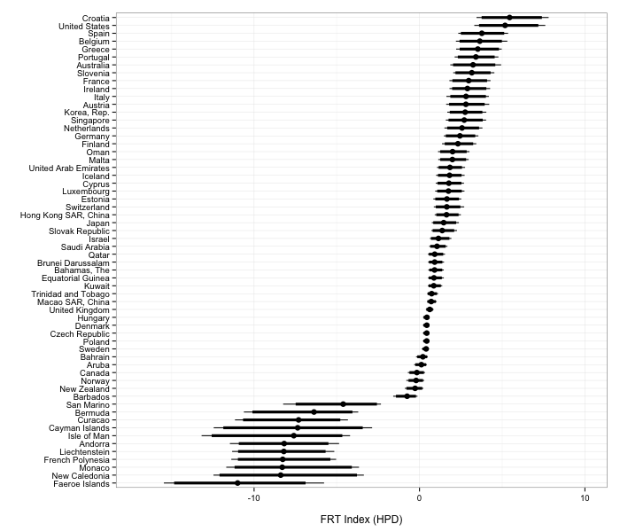
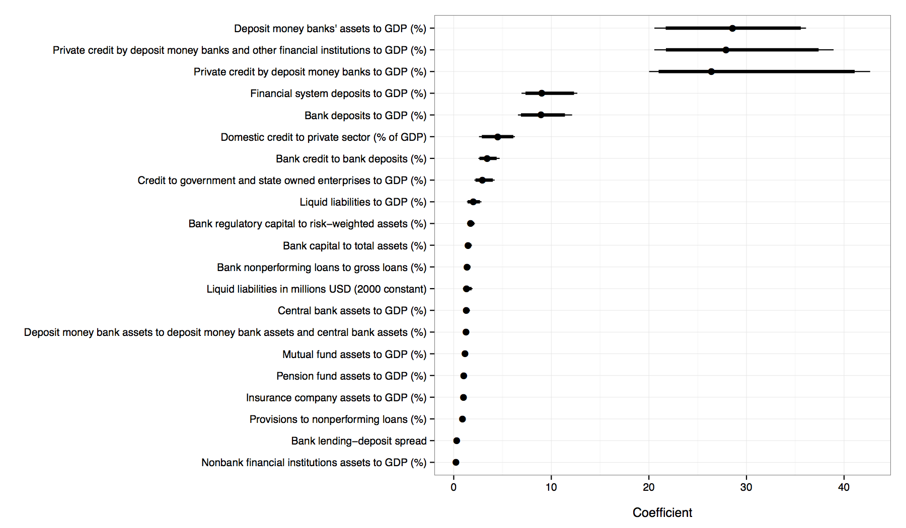

## Slides

<br>

This slide deck is available at:

<br>

<http://christophergandrud.github.io/BasicBayesianPresent>.

## Overview

<br>

- **Theoretical**: What does Bayesian Data Analysis bring to inference?

- **Examples** from my research

- A few practical **tips**

## Motivation

<br>

- We know that Bayesian data analysis (BDA) is **hot** in social science.

- We also know that popularity $\neq$ widespread mastery or even literacy.

## Talk Aims

<br>

- **Begin a discussion** aiming towards BDA literacy.

- Give **examples** of how I've used BDA in my own work and a few **practical tips** I've learned along the way.

## What is statistical inference?

<br>

Drawing **conclusions** based on **data** that is subject to **random variation**, such as observational errors and sampling variation. - Upton (2008), via [Wikipedia](http://en.wikipedia.org/wiki/Statistical_inference#cite_note-Oxford-1)

<br>

BDA and 'frequentist' methods simply provide **different ways** to draw conclusions from data and address random variation.

## Basic Idea behind BDA

<br>

Update **prior** information with **new data** to create a **posterior** probability distribution.

## Gelman et al. (2014, 3) **Three step process**

<br>

1. Set up a **full probability model** (*prior*).

2. Condition on **observed data** (*new data*).

3. Evaluate the **fit** of the model and posterior distribution's **implications** (*posterior*).

## A Key Contribution: Emphasising uncertainty estimation

<br>

- "The **central feature** of Bayesian inference [is] the **direct quantification of uncertainty**" (Gelman et al. 2014, 4).

    - Fewer coefficient tables! Less emphasis on p-value hypothesis testing. Rise of the confidence and probability intervals.

- Many researchers actually interpret 'frequentist' confidence intervals *as if* they were Bayesian probability intervals.

## Uncertainty in Frequentist and Bayesian Approaches (1)

<br>

- Both involve the **estimation of unknown quantities** of interest, e.g. coefficient parameters $\beta$.

- The estimates they produce have **different interpretations**.

## Uncertainty about parameters in Frequentist and Bayesian Approaches (2)

<br>

### Frequentist

- **95% Confidence interval**: Repeated samples will contain the true parameter within the interval 95% of the time.

<br>

### Bayesian 'common sense interpretation'

- **95% Probability (credible) interval**: there is a 95% **probability** that the unknown parameter is actually in the interval.

## Modelling flexibility

<br>

- Can include prior information from different sources, including previous studies, while also incorporating uncertainty.

- Hierarchical models

- Item response models

- Missing data imputation

- And so on . . .

## Notation

<br>

- Good idea to become familiar with BDA notation.

- A nice place to start is: Gelman et al. (2014) pages 4-6.


## A middle ground? (1)

<br>

- [King, Tomz, and Wittenberg (2000)](http://gking.harvard.edu/files/gking/files/making.pdf) offer a middle ground with post-estimation simulations.

- Often less computationally intensive.

- Provides common sense interpretations of quantities of interest + uncertainty.

- However, often not as flexible.

## A middle ground? (2)

<br>

1. Estimate parameters (using preferred model)

2. Use **post-estimation simulations** to estimate uncertainty around quantities of interest.

    - Draw $n$ values of the parameter point estimates ($\hat{\beta}$) from multivariate normal distributions with mean $\hat{\beta}$ and variance specified by the parameter's covariance.

3. Usually plot results.

## A middle ground? (3)

<br>

- Similar overall to Markov-Chain Monte Carlo techniques, but different in how the parameters are drawn.

- [Zelig](http://gking.harvard.edu/zelig) has good capabilities for doing this and I've implemented it for interactions in survival models with [simPH](http://christophergandrud.github.io/simPH/) and dynamic autoregressive relationships in [dynsim](http://christophergandrud.github.io/dynsim/) (with Laron Williams and Guy Whitten).

## BDA Software (1)

<br>

### Predefined Models (with R)

<br>

- [Zelig](http://gking.harvard.edu/zelig)

- [MCMCpack](http://mcmcpack.berkeley.edu/)

<br>

### Open-ended Models (program + R interface)

<br>

- [JAGS](http://mcmc-jags.sourceforge.net/) + [rjags](http://cran.r-project.org/web/packages/rjags/index.html) (part of the [Bugs](http://www.mrc-bsu.cam.ac.uk/software/bugs/) family, but cross-platform)

- [STAN](http://mc-stan.org/index.html) + [RStan](http://mc-stan.org/rstan.html) (potentially faster than Bugs family)

## BDA Software (2)

<br>

### Visualise diagnostics + results

- [coda](http://cran.r-project.org/web/packages/coda/index.html)

- [ggmcmc](http://xavier-fim.net/packages/ggmcmc/)

## My own research: Predefined models

<br>

#### **Federal Reserve Inflation Forecast Errors** (with Cassandra Grafström)

<br>

- **Research question**: does US presidential party ID affect Federal Reserve staff inflation forecast errors?

- **Bayesian methods**: predefined model in Zelig (`normal.bayes`) used primarily to examine model dependence.

- All code available at on [GitHub](https://github.com/christophergandrud/GreenBook).

## My own research: Predefined models

</img>

## My own research: Open-ended Models

<br>

#### **Financial Transparency Index** (with Mark Copelovitch and Mark Hallerberg)

<br>

- **Research question**: what causes financial regulatory transparency and what are its consequences for financial stability?

- **Bayesian methods**: created a Bayesian Item Response model to estimate an unobserved quantity (*financial transparency*) based on whether or not countries had reported data to the World Bank’s Global Financial Development Database.

- All code available at on [GitHub](https://github.com/FGCH/FRTIndex).

## Financial Transparency Index in 2011

</img>

## Discrimination Plot

</img>

## Practical tips (1)

<br>

### Critically use other's code as a starting point

<br>

- Avoids **effort duplication**.

- Code gets **better with use**.

- [Hollyer, Rosendorff, and Vreeland (2014)]() was the starting point of our FRT Index.


## Practical tips (2)

<br>

### Use `cat` to dynamically build probability models

<br>

- Setting up a probability model is an **interative process** as you adjust the parameters to include in the model and the data.

- So it can be good to develop source code that **dynamically** creates the probability model.

---

```{r eval=FALSE,}

cat(paste0('
model{
    for (n in 1:', Num, '){\n',
      Xs, '\n',
      Ps, '\n',
      Qs, '\n',
      Vs,
    '\n }',
  '\n# Model priors\n',
    '
mu[1] <- 0
mu[2] <- 0

alpha[1,1] <- 0.01
alpha[1,2] <- 0
alpha[2,1] <- 0

. . .

  for (n in 1:', NCountry, '){
    transparency[n,1] <-transcentered[n]
    tau[n] ~ dgamma(20, 4)

    for (j in 2:', Nyear, '){
      transparency[n,j] ~ dnorm(transparency[n,(j-1)], tau[n])
    }
  }'),
'\n}'), file = 'BasicModel_V1.bug')

```

<hr>

[full source code](https://github.com/FGCH/FRTIndex/blob/master/source/FRTIndex_CreatorV2.R)

## Practical tips (3)

<br>

### Use [RStudio Server](https://www.rstudio.com/ide/docs/server/getting_started) on (something like) [Amazon EC2](http://aws.amazon.com/ec2/)

<br>

- Conditioning a probability model on observed data can be **computationally intensive**, i.e. it can slow your desktop computer to a crawl.

- Can be useful to run on a **remote server**.

- Relatviely easy to set up (see [here](http://blog.yhathq.com/posts/r-in-the-cloud-part-1.html) and [my FRT code](https://github.com/FGCH/FRTIndex/blob/master/source/AmazonEC2Setup.sh)).

    - Though there is some Linux command line work involved.

- Nonetheless, **aim for computational efficiency**. There may be a **substantive problem** causing your computational problem.

## Resources

<br>

- Gelman, Andrew, et al. 2014. *Bayesian Data Analysis*. 3rd Edition. Boca Raton, FL: CRC Press.

- Nice **comparison of Bayesian vs. Frequentist methods** in data driven **business** from the developers at [Lyst](http://developers.lyst.com/data/2014/05/10/bayesian-ab-testing/).

- **Prediction intervals and confidence intervals**: nice explanatory [post](http://robjhyndman.com/hyndsight/intervals/) by Rob Hyndman.

- **Pretty good practical blog post for setting up Jags**: John Myles White. 2010. [Using JAGS in R with the rjags Package](http://www.johnmyleswhite.com/notebook/2010/08/20/using-jags-in-r-with-the-rjags-package/)
